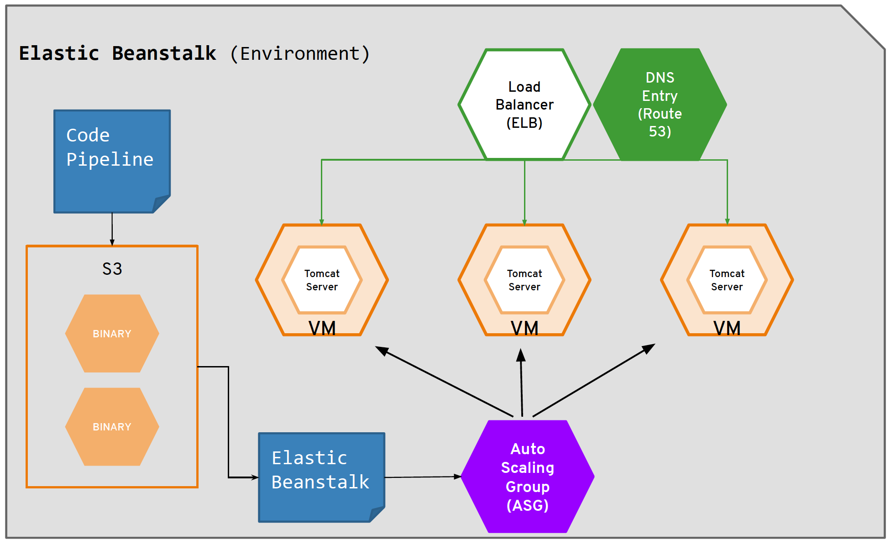
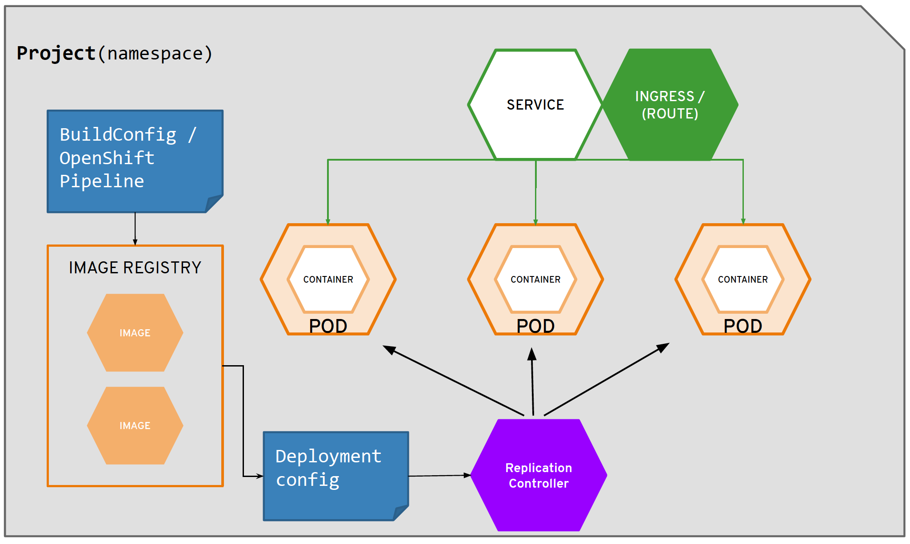
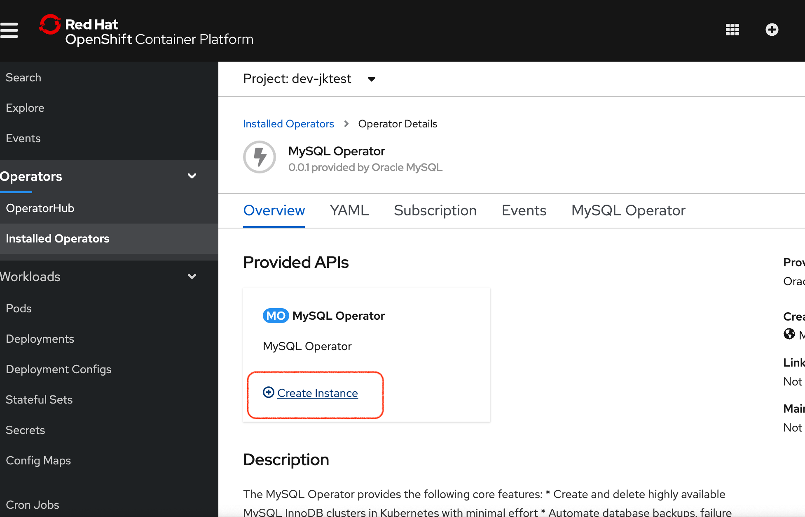
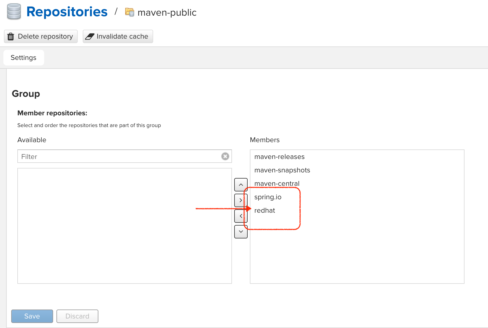
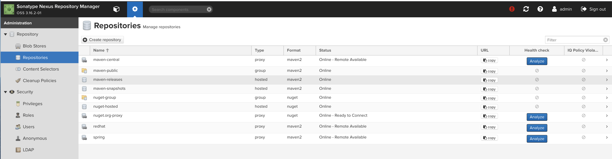
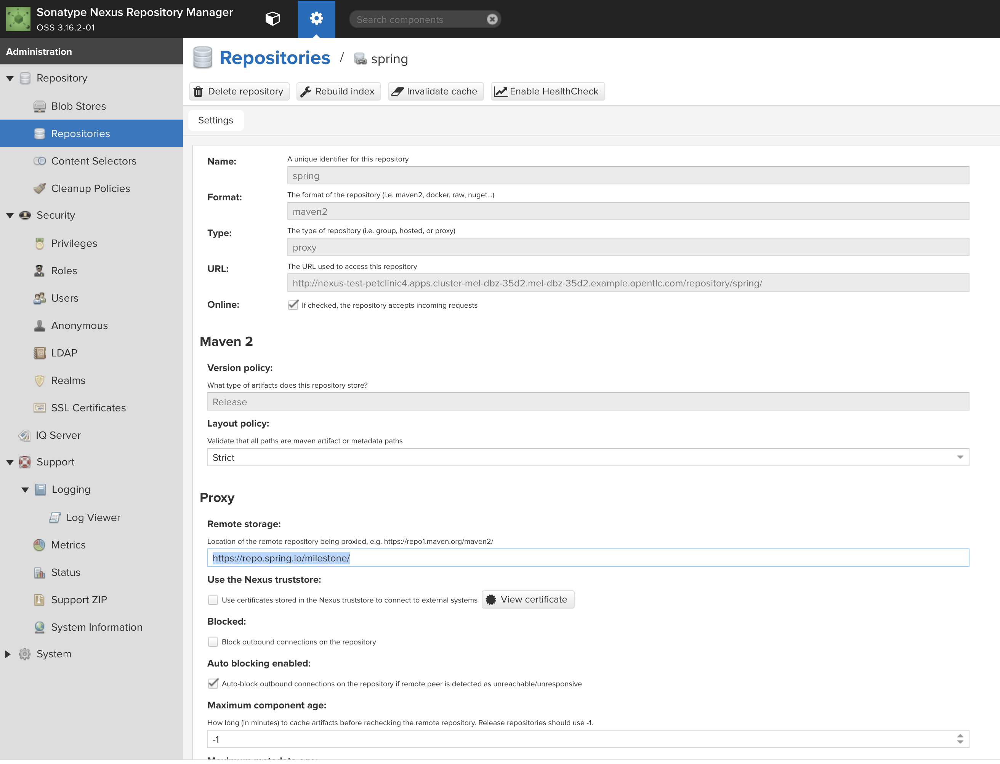
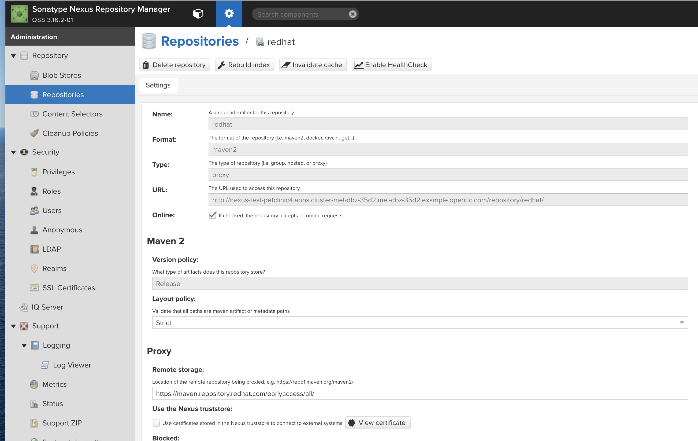
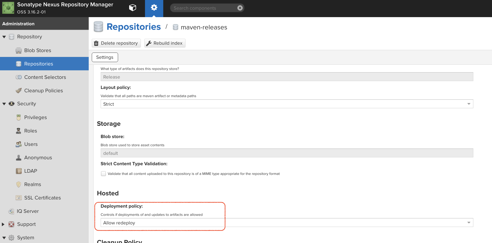

= Comparison Demo: AWS and Openshift =
:experimental:
:toc:
:toclevels: 4

== Introduction == 

This repo contains all the scripts and code (as submodules) needed to create a demo that supports this link:docs/Walkthrough.adoc[walkthrough] that compares and contrasts what it takes to deploy a Tomcat based website in AWS Elastic Beanstalk vs. deploying the same application in Kubernetes/OpenShift.  It is targeted to AWS developers/users who are looking to understand the Kubernetes through the lens of AWSs (non-container based) offerings.  Concepts covered include:

[%header,cols=2*] 
|===
|AWS
|OpenShift

|Code Pipeline
|OpenShift Pipelines (Tekton)

|CodeCommit, CodeBuild
|Gogs, Source2Image and Templates (Tomcat8)

|RDS
|Operators (MySql, Pipelines)

|Elastic Beanstalk 
|OpenShift Developer Perspective
|===

TIP: There is a .devcontainer in this repo so if you have VisualStudio Code with remote extensions enabled, you can open repo folder in a container that has all the tools necessary to run this demo already installed.

Original presentation (Red Hat internal only access for now) is link:https://docs.google.com/presentation/d/1zAQvZrWN8Xr5Kt7mznt6L-VhT3pAcUBz9EWW5QNkxzs/edit#slide=id.g827f3140ec_1_20[here]

The heart of the presentation is using the following diagrams to map AWS components of a website to OpenShift/Kubernetes ones:

[%header,cols=2*] 
|===
|AWS (Elastic Beanstalk) Architecture
|OpenShift Architecture

| 
|

|link:https://bit.ly/aws-eb-arch[Handout]
|link:https://bit.ly/os4-arch[Handout]
|===

_This demo is still a work in progress.  See <<Still To Come,here>> for a list of items that are as of yet unfinished_ 

[WARNING]
====
Make sure you run the following command before executing any of these commands listed in this demo.

----
source scripts/shell-setup.sh 
----
====

== OpenShift Setup ==

=== MySQL Setup ===

First install the operator.  

==== Operator Install ====

===== Helm =====

See information link:https://blogs.oracle.com/developers/introducing-the-oracle-mysql-operator-for-kubernetes[here] for the operator (which can be found link:https://github.com/oracle/mysql-operator[here]).  Even better instructions are link:https://banzaicloud.com/blog/mysql-on-kubernetes/#how-to-install-oracle-mysql-operator[here] from "banzaicloud"

Then install an agent in the project where you want to install the cluster.  

===== OpenShift Operator =====

There is no official OpenShift operator for MySQL.  Instead, this is the Oracle MySQL helm based operator repackaged so that it can be governed by the Operator Lifecycle Manager.  See the sql-operator branch for more info.

[WARNING]
.[red]#FIXME: This step should not be necessary.  This is a problem with how the operator was created#
====
Create the mysql-operator project.  This is where the instance of the mysql operator container will live.  This should really be in 
openshift-operators, but it seems the operator doesn't install the operator CRD instance by default

----
oc new-project mysql-operator
----
====

. Install the custom catalog source
+
NOTE: This assumes the operator csv application is already setup in quay.io.
+
----
oc apply -f $DEMO_HOME/kube/operators/mysql-olm-operator/operator-source.yaml
----
+
.. The operator should then be available in OperatorHub listing under the "custom" provider.  
+
NOTE: If you don't see it there, take a look at the logs of the marketplace pod of the `openshift-marketplace` project
+
. Create an instance of the operator
+

+
. Once created, it should install all the necessary CRDs for setting up a cluster

The rest of the instructions for creating a MySQL instance once the operator is installed is in the link:docs/Walkthrough.adoc[Walkthrough].

=== OpenShift Pipelines (Tekton) ===

Pipeline setup is inspired by this post link:https://developers.redhat.com/blog/2020/02/26/speed-up-maven-builds-in-tekton-pipelines/[here]

From the instructions link:https://github.com/openshift/pipelines-tutorial/blob/master/install-operator.md[here]

==== Pipelines Operator Install ====

. Install subscription (in openshift operators)
+
----
oc apply -f $DEMO_HOME/kube/tekton/tekton-subscription.yaml
----
+
. Optionally install tekton dashboard (for visualization) as per link:https://github.com/tektoncd/dashboard[here]
+
----
oc apply -f $DEMO_HOME/kube/tekton/openshift-tekton-dashboard-release.yaml
oc wait --for=condition=Available deployment/tekton-dashboard -n openshift-pipelines
----
+
. Then you can open the dashboard by hitting this URL.  It will authenticate using OpenShift oauth
+
----
echo "https://$(oc get route tekton-dashboard -o jsonpath='{.spec.host}' -n openshift-pipelines)/"
----
+
. When the operator has finished installing, it will install a pipeline service account in all projects that have sufficient permissions to build stuff.  There is also a centralized openshift-pipelines project that holds pipeline supporting pods.  
+
NOTE: See also tips and tricks from the link:https://github.com/openshift/pipelines-tutorial[pipelines tutorial]

== AWS Setup ==

The AWS setup at this point is quite manual for all aspects except elasticbeanstalk.  See also <<Still to come,Still to Come>> section for more info.

[blue]#If you are running this demo in a container, you will notice that local `.aws` directory is mounted in the container.  This is so that the aws cli that is installed on the devcontainer is able to use your host credentials.#

=== Elastic Beanstalk Setup ===

_From helloworld-pipeline example link:https://medium.com/@xoor/deploying-a-node-js-app-to-aws-elastic-beanstalk-681fa88bac53[here]_

Run the following script and answer the prompts as per the link above

NOTE: When using eb deploy it appears you must first *commit* (but not push) into the (local) git repo that is referenced in the .git of the folder that you eb initialized in.  The branch it looks to is in .elasticbeanstalk/config.yml.

==== Connecting to existing EB Environment with CLI ====

NOTE: See information on link:https://stackoverflow.com/questions/28821632/how-to-configure-eb-cli-with-eb-env-that-is-already-running[this page here].

WARNING: You need to have the eb cli installed for this to work.  The devcontainer for the compatibility project does have these scripts installed so you should be able to run them from there.

1. Change to the directory with the git repo that is deployed to eb
2. run `eb init --profile $AWS_PROFILE`
3. Answer the prompts selecting the appropriate region that you want to use

==== Creating a new EB application ====

NOTE: Each environment (Dev and Staging) can take 15-20 minutes to create

. Navigate to the following directory under the compatibility demo:
+
----
cd $DEMO_HOME/spring-framework-petclinic/
----
+
. Follow the instructions for <<Connecting to existing EB Environment with CLI,Connecting to existing EB Environment with CLI>> but select a new application.  Ensure that you choose the proper region.  I shouldn't matter what type of application you create.
+
.Next, run the following script to create a dev environment (use the -n flag if you'd like an application name other than PetClinic)
+
[red]#FIXME: There may be some parts of the configuration file `$DEMO_HOME/aws/elasticbeanstalk/petclinic-dev.cfg.yml` that 
are still specific to my installation (e.g. bastion ssh key) that still need to be parameterized in the script#
+
----
$DEMO_HOME/workspaces/comparison-demo/scripts/aws-create-beanstalk.sh 
----

=== CodeCommit Setup ===

First, be sure to setup your access following instructions link:https://docs.aws.amazon.com/codecommit/latest/userguide/setting-up.html[here].  Roughly these steps include:

. Add CodeCommitPowerUser policy to your IAM user
. generate a code commit keypair (see link:https://docs.aws.amazon.com/codecommit/latest/userguide/setting-up-ssh-unixes.html[Step 3 of this document] for more details on creating a keypair)
. Create a CodeCommit repo
. Copy the SSH key

While this setup is not yet automated, you can use the AWS cli with (end-user edited) configuration files as in link:aws/codecommit[this directory].

=== CodeBuild Setup ===

To support the <<AWS Pipeline Setup,AWS Code Pipeline>> you need to set up a couple different builds.  Many of these will be governed by buildspec*.yml files in the `spring-framework-petclinic` submodule.  At the time of writing this these are:

* buildspec-sonarqube.yml 
* buildspec-unittest.yml 
* buildspec.yml

While this is not yet automated, you can use the AWS cli with (end-user edited) configuration files as in link:aws/codebuild[this directory].

=== AWS Pipeline Setup ===

Before you setup the pipeline, you need to first setup a CodeCommit repo as well as setup all the target Elastic Beanstalk environments above.  Much of the instructions here are inspired from the helloworld-pipeline example link:https://medium.com/@xoor/using-aws-codepipeline-to-automate-deployments-to-elasticbeanstalk-e80ca988ef70[here]

1. Create the <<CodeCommit Setup, code commit repo>>

2.  Create and name the pipeline

* be sure to create a servicerole

Then select your source (GitHub) in this case

== Demo Troubleshooting ==

=== MySQL ===

You can test access to a MySQL database in an OpenShift cluster using the `Adminer` image.

. First, setup port forwarding to the service in question (assuming a petclinic based service as shown in the walkthrough)
+
----
oc port-forward svc/petclinic-mysql 3306:3306
----
+
. Then, in another shell, run the `Adminer` image and have it port forward to 8080. _NOTE: Assumes you are running on a Mac using Docker for Mac, this is where the `docker.for.mac.localhost` stuff comes from_
+
----
docker run -p 8080:8080 -e ADMINER_DEFAULT_SERVER=docker.for.mac.localhost adminer:latest
----
+
. From the `Adminer` web page, login as root (using whatever secret was used in the setup of the cluster).  You can then run arbitrary commands.  Here are the commands you can run to grant access to a user pc to a newly created petclinic database (from link:https://linuxize.com/post/how-to-create-mysql-user-accounts-and-grant-privileges/[here])
+
----
CREATE USER 'pc'@'%' IDENTIFIED BY 'petclinic';
CREATE DATABASE petclinic;
GRANT ALL PRIVILEGES ON petclinic.* TO 'pc'@'%';
----
+
.. Or instead, you run SQL commands from the local command line
+
----
oc run mysql-client --image=mysql:5.7 --restart=Never --rm=true --attach=true --wait=true \
    -- mysql -h petclinic-mysql -uroot -ppetclinic -e "CREATE USER 'pc'@'%' IDENTIFIED BY 'petclinic'; \
      CREATE DATABASE petclinic; \
      GRANT ALL PRIVILEGES ON petclinic.* TO 'pc'@'%';"
----

===== Cluster fails to appear =====

Check the logs of the mysql-operator pod in the mysql-operator project

----
oc logs deployment/mysql-operator -n mysql-operator -f
----

One known issue is that you can't make your clustername too long:

----
E0317 07:08:48.666574       1 controller.go:291] error syncing 'test-petclinic4/mysql-cluster-with-3-replicas': validating Cluster: metadata.name: Invalid value: "mysql-cluster-with-3-replicas": longer than maximum supported length 28 (see: https://bugs.mysql.com/bug.php?id=90601)
----

===== Configuration Error on Pod =====

Check to make sure you've actually created the secret configured for the cluster

=== Troubleshooting (Local) Tomcat Server ===

If the tomcat extension fails to run, you can attempt the following:

. remote any old tomcat files
+
----
rm -f /opt/webserver/webse*
----
+
. Attempt to readd tomcat to /opt/webserver per the instructions above
+
. if that still doesn't work, rebuild container.
+
. If all else fails, [blue]#you can run the tomcat server locally#.  

=== CI/CD Project Install ===

NOTE: The script referenced is run during the link:docs/Walkthrough.adoc[Walkthrough].  This just gives a little more info if needed for troubleshooting

A good example on how to get this running with SpringBoot is link:https://github.com/siamaksade/tekton-cd-demo[here].  This demo is heavily based on it.  link:https://developer.ibm.com/blogs/create-a-serverless-pipeline-using-newly-enhanced-tekton-features/[this] is also a good article about a number of Tekton features used in this demo (such as workspaces) including some others that aren't yet being used (e.g. conditions)

Run the following script to setup the entire cicd project (it will create a project called `<PROJECT_PREFIX>-cicd` (where `<PROJECT_PREFIX>` is the value passed to --project-prefix in the command below) if it doesn't exist already to install all the artifacts into.

----
$DEMO_HOME/scripts/create-cicd.sh install --project-prefix petclinic --user USER --password <PASSWORD>
----

The `<USER>` and `<PASSWORD>` that is passed in is the user and password needed to create a pull secret for registry.redhat.io.  This is needed for the s2i images.  It will basically associate this secret with the pipelines service account.  NOTE: you can use a redhat registry server account name and password instead of your own login and password

WARNING: This must be run *after* the corresponding development environment (e.g. petclinic-dev) has been created or the script will fail.  This is due to the cicd pipeline needing to update the permissions of the pipeline service account to be able to "see into and change" (e.g. edit) the dev project

=== OpenShift Nexus Installation ===

The `$DEMO_HOME/scripts/create-cicd.sh` will create a Nexus instance within the `petclinic-cicd` project and will configure the repo accordingly so that the application can be built appropriately.  Should something go wrong, this section outlines steps that the script should have undertaken so that you can troubleshoot.

The original petclinic app uses some repos outside of maven central.  Namely:

* https://maven.repository.redhat.com/earlyaccess/all/
* https://repo.spring.io/milestone/

Here's how you would manually configure these in Nexus:

. Connect to the nexus instance (see route) 
+
----
echo "http://$(oc get route nexus -n petclinic-cicd -o jsonpath='{.spec.host}')/"
----
+
. Log into the nexus instance (standard nexus setup has admin, admin123)
+
. Go to _Repositories_ and _Create Repository_ for each of the repos needed
+

+
.. Here's example configuration for each of the above
+

+
. Add the two registries to the maven-public group as per the screenshot
+
[red]#FIXME: This is necessary until every build gets a semantic version number update#
+
. Update the `maven-releases` repo to allow updates like below:
+

=== OpenShift Pipeline (Git) Triggers ===

Tekton allows for `EventListeners`, `TriggerTemplates`, and `TriggerBindings` to allow a git repo to hit a webhook and trigger a build.  See also link:https://github.com/tektoncd/triggers[here].  To get basic triggers going for both gogs and github run the following:

NOTE: For an example of triggers working with Tekton, see files link:https://github.com/siamaksade/tekton-cd-demo/tree/master/triggers[in the template directory of this repo]

NOTE: You may also want to consider link:https://github.com/tektoncd/experimental/blob/master/webhooks-extension/docs/GettingStarted.md[this tekton dashboard functionality]

YAML resources for the pipeline created for this demo can be found in these locations:

. Resources: $DEMO_HOME/kube/tekton/resources
. Triggers: $DEMO_HOME/kube/tekton/triggers

==== Triggered Pipeline Fails to Run ====

If the trigger doesn't appear to fire, then check the logs of the pod that is running that represents the webhook.  The probably is likely in the `PipelineRun` template.

==== Viewing (Extended) OpenShift Pipeline (Tekton) Logs ====

You can see limited logs in the Tekton UI, but if you want the full logs, you can access these from the command line using the `tkn` command

----
# Get the list of pipelineruns in the current project
tkn pipelinerun list

# Output the full logs of the named pipeline run (where petclinic-deploy-dev-run-j7ktj is a pipeline run name )
tkn pipelinerun logs petclinic-deploy-dev-run-j7ktj
----

To output the logs of a currently running pipelinerun (`pr`) and follow them, use:

----
tkn pr logs -L -f
----

=== Troubleshooting ElasticBeanstalk ===

==== ssh Connection to Instances ====

You can connect to an instance to debug and troubleshoot it by running this command (where `PetClinic-dev` is the name of the environment that you've created)

NOTE: You must have whatever key you referenced in the petclinic config available to the environment (see `.devcontainer`, it's assumed the key is available in the host's `.ssh` directory)

----
eb ssh PetClinic-dev
----

You can find the tomcat logs in the following directory:

----
cd /usr/share/tomcat8/logs
tail -f catalina.out
----

You can restart the webserver with

----
cd /usr/share/tomcat8
# clear out the old logs
sudo rm logs/catalina.out
sudo service tomcat8 restart
----

==== Saving an ElasticBeanstalk configuration with the CLI ====

As long as you have <<Connecting to existing EB Environment with CLI,linked an EB application to the CLI>> you can download a configuration using the EB CLI eb config command, as shown in the following example. NAME is the name of your saved configuration.

----
$ eb config get PetClinic3

Configuration saved at: /workspaces/comparison-demo/spring-framework-petclinic/.elasticbeanstalk/saved_configs/PetClinic3.cfg.yml
----

To get a list of configurations, run

----
eb config list
----

==== Updating an ElasticBeanstalk configuration with the CLI ====

Once you have <<Saving a configuration with the CLI,downloaded a configuration>> you can edit that configuration locally and then update it.

1. First open your configuration file that you downloaded previously (e.g. `.elasticbeanstalk/saved_configs/PetClinic3.cfg.yml`)

** for example, change the description of the configuration

2. Run `eb config put .elasticbeanstalk/saved_configs/PetClinic.cfg.yml`

3. To apply the configuration, open the console (`eb console` or `eb console -debug` when in a container to get the command to print out the EB console URL)

NOTE: For more information on the create command see link:https://docs.aws.amazon.com/elasticbeanstalk/latest/dg/eb3-create.html[here]

=== Troubleshooting RDS Databases ===

Access databases by using SSH to the RDS instance (or to any instance that has access to the RDS instance you want to access) and forwarding port 3306 locally through to the database server.  `mwh-bastion.pem` is the ssh cert you used to setup the EB environment

----
 ssh -i "mwh-bastion.pem" ec2-user@ec2-13-210-144-99.ap-southeast-2.compute.amazonaws.com -L 3306:aa3s38alasq0v1.cjpxzung9qid.ap-southeast-2.rds.amazonaws.com:3306
----

[NOTE]
====
It may also be possible to use eb ssh to accomplish this using the eb cli

----
eb ssh -c "-L 3306:aa5pwvn1s0ap5r.cjpxzung9qid.ap-southeast-2.rds.amazonaws.com:3306"
----

except that running in a container it appears binding on the port doesn't work properly
====

Then use the `Adminer` pod to debug

----
docker run -p 8080:8080 -e ADMINER_DEFAULT_SERVER=docker.for.mac.localhost adminer:latest
----

== Appendix ==

=== Still To Come ===

. Programmatic creation of AWS Components (currently only Elastic Beanstalk supported).  See .json files link:aws[here]
. Update OpenShift Pipeline UnitTest to use surefire:test goal for unit test (and allow viewing of report)
. OpenShift pipeline to update version number of every build
. Add a TaskRun that would support cleaning the maven build and/or deleting all build and package artifacts in the maven workspace
. Update the OLM MySQL Operator to have a custom icon and reference relevant CRDs (like Cluster)