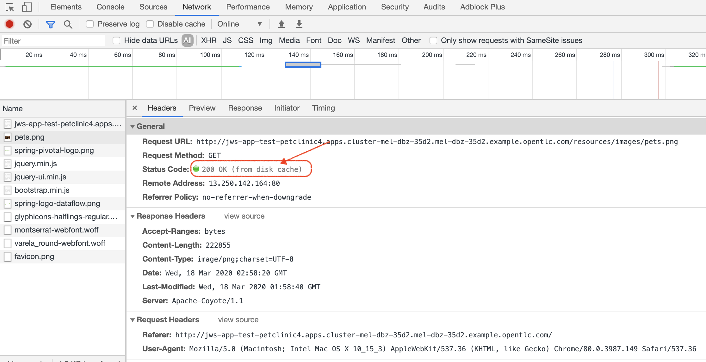
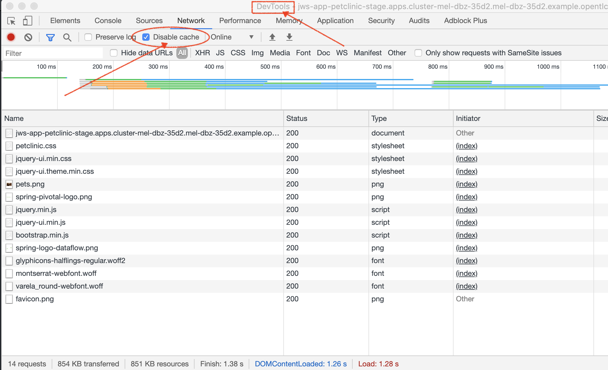
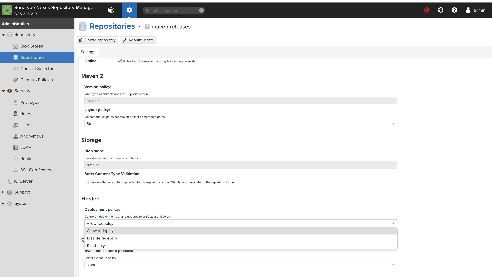

= Comparison Demo: AWS and Openshift =
:experimental:

== MySQL Setup ==

First install the operator

=== Operator Install ===

==== Helm ====

See information link:https://blogs.oracle.com/developers/introducing-the-oracle-mysql-operator-for-kubernetes[here] for the operator (which can be found link:https://github.com/oracle/mysql-operator[here]).  Even better instructions are link:https://banzaicloud.com/blog/mysql-on-kubernetes/#how-to-install-oracle-mysql-operator[here] from "banzaicloud"

Then install an agent in the project where you want to install the cluster.  

==== OpenShift Operator ====

[WARNING]
.[red]#FIXME: This step should not be necessary.  This is a problem with how the operator was created#
====
Create the mysql-operator project.  This is where the instance of the mysql operator container will live.  This should really be in 
openshift-operators, but it seems the operator doesn't install the operator CRD instance by default

----
oc new-project mysql-operator
----
====

Install the custom catalog source

NOTE: This assumes the operator csv application is already setup in quay.io.

----
oc apply -f $DEMO_HOME/kube/operators/mysql-olm-operator/operator-source.yaml
----

The operator should then be available in OperatorHub listing under the "custom" provider.  

NOTE: If you don't see it there, take a look at the logs of the marketplace pod of the `opernshift-marketplace` project

Create an instance of the operator

image:images/operator-instance.png[]

Once created, it should install all the necessary CRDs for setting up a cluster

=== MySQL Instance ===

Go to the project into which you want to deploy the cluster

NOTE: For OpenShift, it appears the mysql instances need elevated permissions so the mysql-agent needs anyuid scc

----
oc apply -f $DEMO_HOME/kube/operators/mysql/mysql-agent.yaml
oc adm policy add-scc-to-user anyuid -z mysql-agent 
----

Create a root password secret to use for the cluster

----
oc create secret generic mysql-root-password --from-literal=password="petclinic"
----

[NOTE]
====
You can let the operator create the password for you.  If you follow this route, you'll need to fish out the password yourself.  Assuming the cluster is named `jws-app-mysql` (running this command in the project in which it is installed):

----
oc get secret jws-app-mysql-root-password -o jsonpath="{.data.password}" | base64 --decode
----
====

Then install an instance of a MySQL Cluster

----
oc apply -f $DEMO_HOME/kube/operators/mysql/mysql-cluster-instance.yaml
----

Next create a service to represent acccess to the current cluster master

----
oc apply -f $DEMO_HOME/kube/operators/mysql/mysql-primary-service.yaml
----

Test access to the database using Adminer

----
oc port-forward svc/jws-app-mysql 3306:3306
docker run -p 8080:8080 -e ADMINER_DEFAULT_SERVER=docker.for.mac.localhost adminer:latest
----

Login as root (using the secret above) and run these commands (from link:https://linuxize.com/post/how-to-create-mysql-user-accounts-and-grant-privileges/[here])

----
CREATE USER 'pc'@'%' IDENTIFIED BY 'petclinic';
CREATE DATABASE petclinic;
GRANT ALL PRIVILEGES ON petclinic.* TO 'pc'@'%';
----

Or run these on a local command line
----
oc run mysql-client --image=mysql:5.7 --restart=Never --rm=true --attach=true --wait=true \
    -- mysql -h jws-app-mysql -uroot -ppetclinic -e "CREATE USER 'pc'@'%' IDENTIFIED BY 'petclinic'; \
      CREATE DATABASE petclinic; \
      GRANT ALL PRIVILEGES ON petclinic.* TO 'pc'@'%';"
----

==== Troubleshooting ====

===== Cluster fails to appear =====

Check the logs of the mysql-operator pod in the mysql-operator project

----
oc logs deployment/mysql-operator -n mysql-operator -f
----

One known issue is that you can't make your clustername too long:

----
E0317 07:08:48.666574       1 controller.go:291] error syncing 'test-petclinic4/mysql-cluster-with-3-replicas': validating Cluster: metadata.name: Invalid value: "mysql-cluster-with-3-replicas": longer than maximum supported length 28 (see: https://bugs.mysql.com/bug.php?id=90601)
----

===== Configuration Error on Pod =====

Check to make sure you've actually created the secret configured for the cluster

== Pipelines (Tekton) ==

Pipeline setup is inspired by this post link:https://developers.redhat.com/blog/2020/02/26/speed-up-maven-builds-in-tekton-pipelines/[here]

.TODO
****

1. Support a separate CI/CD environment
1. Instead of image trigger in Dev, do an actual deployment (using oc command tasks)
4. Integrate with Jenkins instead
5. Show integration with external (maybe code deploy?)
6. Any Other aspects of pipeline to match code deploy?
2. Attempt to use a workspace (for example see link:https://github.com/siamaksade/tekton-cd-demo/blob/master/pipelines/pipeline-pvc.yaml[here]) to further speed up the build (doesn't appear to have made a significant difference to build times in the way that it's currently used in the tutorial)

----
[INFO] BUILD SUCCESS
[INFO] ------------------------------------------------------------------------
[INFO] Total time: 01:58 min
[INFO] Finished at: 2020-03-18T02:04:03Z
[INFO] Final Memory: 75M/226M
----

****

From the instructions link:https://github.com/openshift/pipelines-tutorial/blob/master/install-operator.md[here]

=== Pipelines Operator Install ===

1. Install subscription (in openshift operators)
----
oc apply -f $DEMO_HOME/kube/tekton/tekton-subscription.yaml
----

2. Optionally install tekton dashboard (for visualization) as per link:https://github.com/tektoncd/dashboard[here]

----
oc apply -f $DEMO_HOME/kube/tekton/openshift-tekton-dashboard-release.yaml
oc wait --for=condition=Available deployment/tekton-dashboard -n openshift-pipelines
----

Then you can open the dashboard by hitting this URL.  It will authenticate using OpenShift oauth

----
echo "https://$(oc get route tekton-dashboard -o jsonpath='{.spec.host}' -n openshift-pipelines)/"
----

When the operator has finished installing, it will install a pipeline service account in all projects that have sufficient permissions to build stuff.  There is also a centralized openshift-pipelines project that holds pipeline supporting pods.  

NOTE: See also tips and tricks from the link:https://github.com/openshift/pipelines-tutorial[pipelines tutorial]

=== CI/CD Project Install ===

3. Create the CI/CD project

----
oc new-project petclinic-cicd
----

4. Create a pull secret for registry.redhat.io.  This is needed for the s2i images.  It will basically associate this secret with the pipelines service account.  NOTE: you can use a redhat registry server account name and password instead of your own login and password

----
$DEMO_HOME/scripts/util-create-pull-secret.sh registry-redhat-io --project petclinic-cicd -u <USER> -p <PASS> 
----

5. Run the following script to setup the entire cicd project (it will create a project called `<PROJECT_PREFIX>-cicd` (where `<PROJECT_PREFIX>` is the value passed to --project-prefix in the command below) if it doesn't exist already to install all the artifacts into

WARNING: This must be run *after* the corresponding development environment (e.g. petclinic-dev) has been created or the script will fail.  This is due to the cicd pipeline needing to update the permissions of the pipeline service account to be able to "see into and change" (e.g. edit) the dev project

----
$DEMO_HOME/scripts/create-cicd.sh install --project-prefix petclinic
----

== Setup "Staging" Environment ==

1. Create a new project

[red]#FIXME: provide real values#
----
oc process -f $DEMO_HOME/kube/staging-project-template.yaml -p APP_NAME=jws-app -p DEVELOPMENT_PROJECT=test-petclinic4 -p STAGING_PROJECT=petclinic-stage -p PROJECT_NAME=test-petclinic4 | oc apply -f -
----

2. Create MySQL cluster (assumes MySQL Operator already running in cluster)

----
$DEMO_HOME/scripts/create-sql-cluster.sh
----

[red]#FIXME: This pipeline needs to be setup in the ci/cd environment either from the script run to create the staging environment or now
2. Create pipeline for staging (including creation of a local custom task)

[red]#FIXME: provide real values for parameters#
----
 oc process -f $DEMO_HOME/kube/tekton/pipelines/petclinic-stage-pipeline-tomcat-template.yaml -p DEV_APP_NAME=jws-app -p APP_NAME=jws-app -p PROJECT_NAME=test-petclinic4 -p STAGING_PROJECT=petclinic-stage -p DEVELOPMENT_PROJECT=test-petclinic4 | oc apply -f -

 oc apply -f $DEMO_HOME/kube/tekton/tasks/oc-task.yaml -n test-petclinic4

 oc policy add-role-to-user edit system:serviceaccount:test-petclinic4:pipeline -n petclinic-stage
----

=== Setup Git Triggers ===

Tekton allows for `EventListeners`, `TriggerTemplates`, and `TriggerBindings` to allow a git repo to hit a webhook and trigger a build.  See also link:https://github.com/tektoncd/triggers[here].  To get basic triggers going for both gogs and github run the following:

NOTE: For an example of triggers working with Tekton, see files link:https://github.com/siamaksade/tekton-cd-demo/tree/master/triggers[in the template directory of this repo]

NOTE: You may also want to consider link:https://github.com/tektoncd/experimental/blob/master/webhooks-extension/docs/GettingStarted.md[this tekton dashboard functionality]

Create pipeline resources for trigger

----
oc apply -f $DEMO_HOME/kube/tekton/resources
----

Create trigger

----
oc apply -f $DEMO_HOME/kube/tekton/triggers
----

==== Troubleshooting ====

If the trigger doesn't appear to fire, then check the logs of the pod that is running that represents the webhook.  The probably is likely in the `PipelineRun` template.

=== Setting up Nexus ===

Builds can be up to 4 minutes faster using Nexus, however, due to some non-maven central repos some custom configuration may be necessary after initial setup.  If you run into issues then check <<Missing Repos,the steps here>>

A good example on how to get this running with SpringBoot is link:https://github.com/siamaksade/tekton-cd-demo[here].  For the purposes of this demo, in general, to use nexus do the following:

1. Deploy nexus in the same project as your pipeline

----
oc apply -f $DEMO_HOME/kube/nexus/nexus.yaml
----

2. Patch the pipeline to use the nexus mirror (again, assuming installation in the same project as the pipeline)

----
oc patch pipeline/petclinic-deploy-dev-tomcat --type='json' -p '[{"op": "add", "path": "/spec/tasks/0/params/1", "value": {"name": "MAVEN_MIRROR_URL","value": "http://nexus:8081/repository/maven-public/" } }]'

----

Depending on the tasks in your pipeline, some tasks (like maven test) require the setting of a `MAVEN_SETTINGS_CONFIGMAP` variable which is meant to name a configmap on the cluster that refers to a settings.xml that should be used in the maven run.

See link:kube/nexus/configmap-custom-maven-settings.yaml[this] file for an example configmap to use the nexus repo.

----
oc apply -f $DEMO_HOME/kube/nexus/configmap-custom-maven-settings.yaml
----

=== Troubleshooting ===

==== Images missing ====

If after your (re)build you find that an image you changed is not appearing, attempt to clear your cache.

One way on chrome to do this is via the DevTools ( kbd:[F12] )

==== Release issues ====

If you get errors when releasing, check the pipeline run logs using this command:

----
tkn pipelinerun logs petclinic-dev-pipeline-tomcat-run-mxgt4 -t release-app
----

If you see the following in the log output then you either need to fix the version number increment or change the nexus repository to allow updates
----
[release-app : mvn] [ERROR] Failed to execute goal org.apache.maven.plugins:maven-deploy-plugin:2.7:deploy (default-deploy) on project spring-framework-petclinic: Failed to deploy artifacts: Could not transfer artifact org.springframework.samples:spring-framework-petclinic:war:5.2.4 from/to nexus (http://nexus:8081/repository/maven-releases/): Transfer failed for http://nexus:8081/repository/maven-releases/org/springframework/samples/spring-framework-petclinic/5.2.4/spring-framework-petclinic-5.2.4.war 400 Repository does not allow updating assets: maven-releases -> [Help 1]
----

Log into nexus as an admin, select the maven releases repo, and make sure _Allow redeploy_ is set under _Deployment policy_

==== Missing Repos ====

Builds using nexus fail with errors like this:

----
[INFO] Downloading: http://nexus:8081/repository/maven-public/org/springframework/data/spring-data-jdbc-core/2.0.0.M1/spring-data-jdbc-core-2.0.0.M1.pom
[WARNING] The POM for org.springframework.data:spring-data-jdbc-core:jar:2.0.0.M1 is missing, no dependency information available
----

The original petclinic app uses some repos outside of maven central.  Namely:

* https://maven.repository.redhat.com/earlyaccess/all/
* https://repo.spring.io/milestone/

You need to manually configure these repos in nexus.

1. Connect to the nexus instance (see route) 

2. Log into the nexus instance (standard nexus setup has admin, admin123)

3. Go to _Repositories_ and _Create Repository_ for each of the repos needed

image:images/nexus-repositories.png[]

4. Here's example configuration for each of the above

image:images/nexus-spring-repo.png[Spring]
image:images/nexus-redhat.png[Red Hat]

5. You might need to add each site's certificate to the Nexus trust store.  This can be done by clicking on _View Certificate_ and using the _+_ to add to truststore

6. Add the two registries to the maven-public group as per the screenshot

image:images/nexus-maven-public.png[]

==== Logs ====

You can see limited logs in the Tekton UI, but if you want the full logs, you can access these from the command line using the `tkn` command

----
# Get the list of pipelineruns in the current project
tkn pipelinerun list

# Output the full logs of the named pipeline run (where petclinic-deploy-dev-run-j7ktj is a pipeline run name )
tkn pipelinerun logs petclinic-deploy-dev-run-j7ktj
----

To output the logs of a currently running pipelinerun (`pr`) and follow them, use:

----
tkn pr logs -L -f
----

== EB Environment ==

_From helloworld-pipeline example link:https://medium.com/@xoor/deploying-a-node-js-app-to-aws-elastic-beanstalk-681fa88bac53[here]_

Run the following script and answer the prompts as per the link above

NOTE: When using eb deploy it appears you must first *commit* (but not push) into the (local) git repo that is referenced in the .git of the folder that you eb initialized in.  The branch it looks to is in .elasticbeanstalk/config.yml.

== Connecting to existing EB Environment with CLI ==

NOTE: See information on link:https://stackoverflow.com/questions/28821632/how-to-configure-eb-cli-with-eb-env-that-is-already-running[this page here].

1. Change to the directory with the git repo that is deployed to eb
2. run `eb init --profile $AWS_PROFILE`
3. Select the application you want to use

== Saving a configuration with the CLI ==

As long as you have <<Connecting to existing EB Environment with CLI,linked an EB application to the CLI>> you can download a configuration using the EB CLI eb config command, as shown in the following example. NAME is the name of your saved configuration.

----
$ eb config get PetClinic3

Configuration saved at: /workspaces/comparison-demo/spring-framework-petclinic/.elasticbeanstalk/saved_configs/PetClinic3.cfg.yml
----

To get a list of configurations, run

----
eb config list
----

== Updating a configuration with the CLI ==

Once you have <<Saving a configuration with the CLI,downloaded a configuration>> you can edit that configuration locally and then update it.

1. First open your configuration file that you downloaded previously (e.g. `.elasticbeanstalk/saved_configs/PetClinic3.cfg.yml`)

** for example, change the description of the configuration

2. Run `eb config put .elasticbeanstalk/saved_configs/PetClinic3.cfg.yml`

3. To apply the configuration, open the console (`eb console` or `eb console -debug` when in a container to get the command to print out the EB console URL)

== Create from a configuration ==

NOTE: For more information on the create command see link:https://docs.aws.amazon.com/elasticbeanstalk/latest/dg/eb3-create.html[here]

If you have a valid configuration file, you can use it to create a new environment with the `eb create` command

For example, to use a (local or saved) cfg.yml file named `PetClinic3`

----
$ eb create petclinic-clone --cfg PetClinic3
Creating application version archive "app-200313_080552".
Uploading petclinic-3/app-200313_080552.zip to S3. This may take a while.
Upload Complete.
Environment details for: petclinic-clone
  Application name: petclinic-3
  Region: ap-southeast-2
  Deployed Version: app-200313_080552
  Environment ID: e-qmxmyjbqr7
  Platform: arn:aws:elasticbeanstalk:ap-southeast-2::platform/Tomcat 8.5 with Java 8 running on 64bit Amazon Linux/3.3.3
  Tier: WebServer-Standard-1.0
  CNAME: UNKNOWN
  Updated: 2020-03-13 08:05:58.808000+00:00
Printing Status:
2020-03-13 08:05:57    INFO    createEnvironment is starting.
...

----

== Tomcat Instance Troubleshooting ==

You can find the tomcat home directory at `/usr/share/tomcat`.  See the `logs/catalina.out` for the most recent logfile.

To restart the server, use

----
sudo service tomcat8 restart
----

== RDS Debugging ==

Access databases by using SSH to the RDS instance and forwarding port 3306 locally through to the database server

----
 ssh -i "mwh-bastion.pem" ec2-user@ec2-13-210-144-99.ap-southeast-2.compute.amazonaws.com -L 3306:aa3s38alasq0v1.cjpxzung9qid.ap-southeast-2.rds.amazonaws.com:3306
----

Then use the adminer pod to debug

----
docker run -p 8080:8080 -e ADMINER_DEFAULT_SERVER=docker.for.mac.localhost adminer:latest
----

== AWS Pipeline ==

_From helloworld-pipeline example link:https://medium.com/@xoor/using-aws-codepipeline-to-automate-deployments-to-elasticbeanstalk-e80ca988ef70[here]_

First create and name the pipeline

* be sure to create a servicerole

Then select your source (GitHub) in this case

== AWS Code Commit ==

First, be sure to setup your access following instructions link:https://docs.aws.amazon.com/codecommit/latest/userguide/setting-up.html[here].

* Add CodeCommitPowerUser policy to your IAM user
* generate a code commit keypair (see link:https://docs.aws.amazon.com/codecommit/latest/userguide/setting-up-ssh-unixes.html[Step 3 of this document] for more details on creating a keypair)
* Create a CodeCommit repo
* Copy the SSH key

== AWS Code Deploy Agent ==
