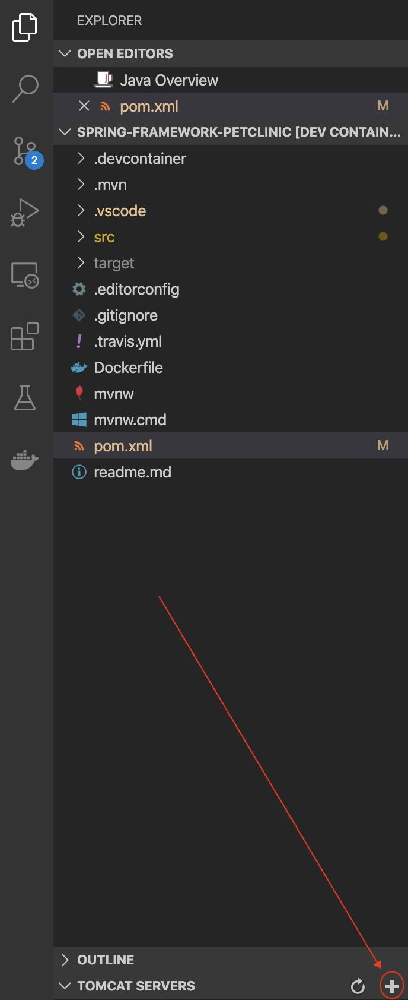
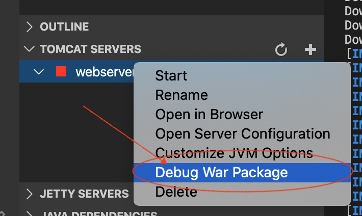
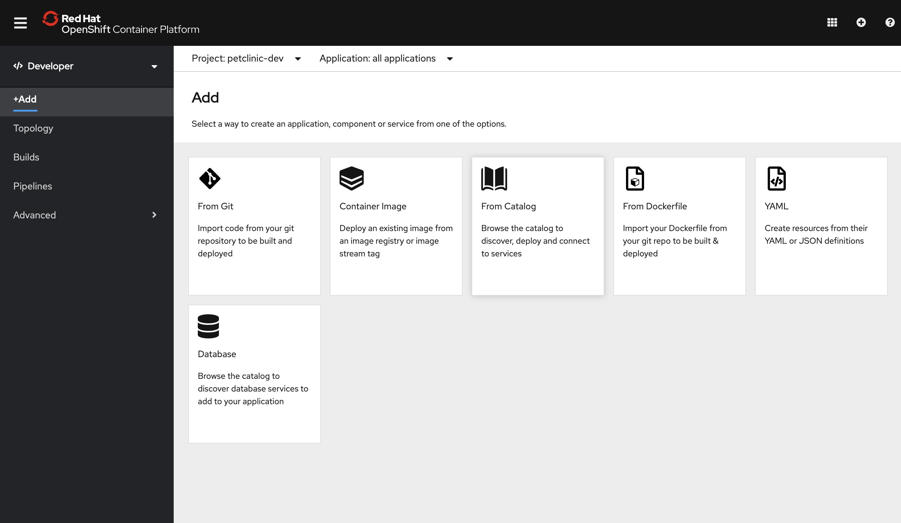
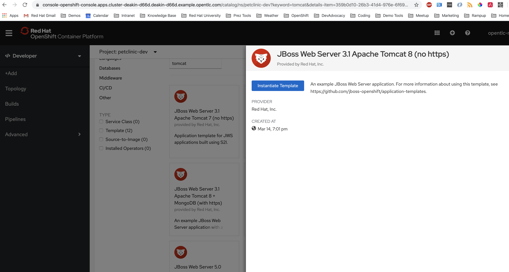
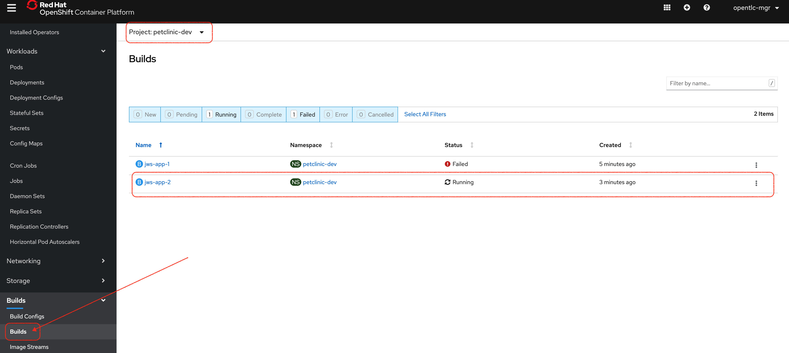
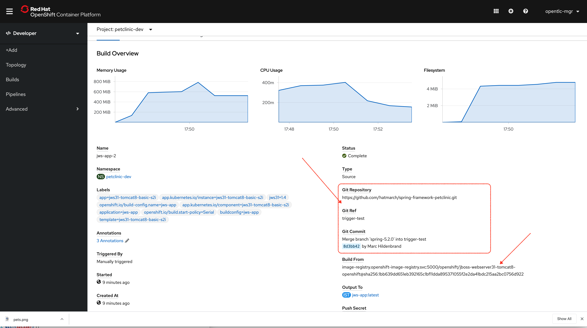
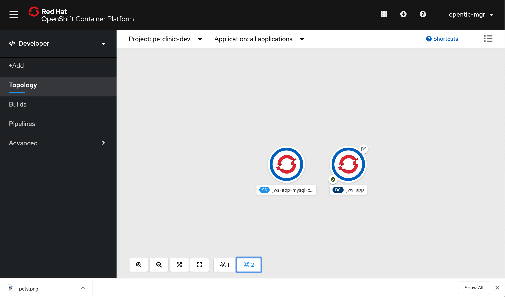
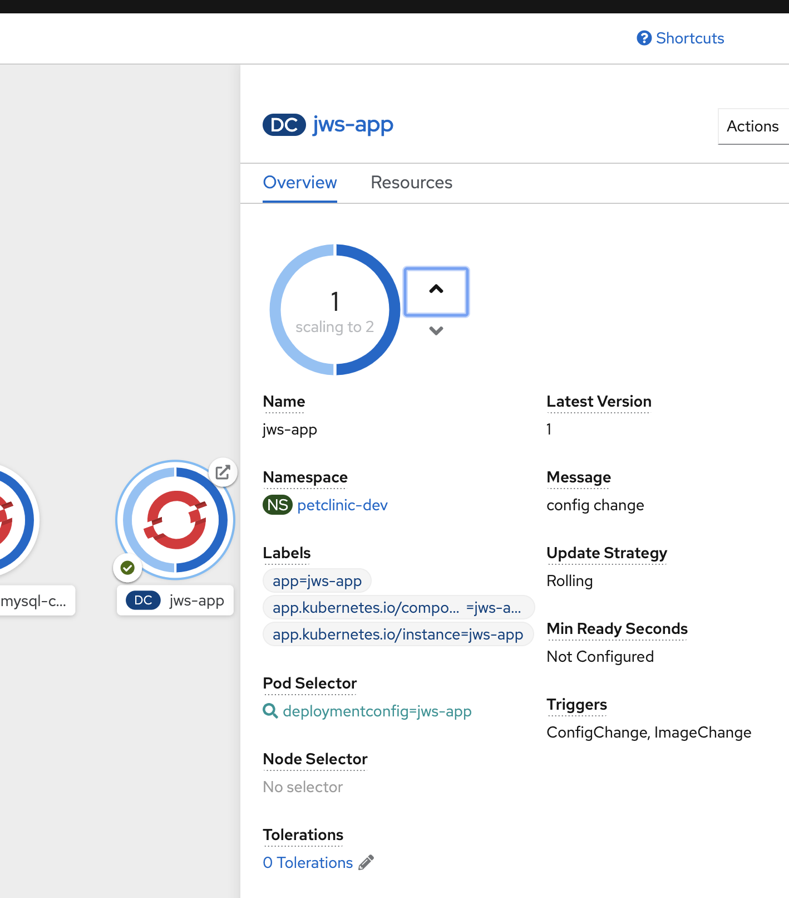

= Comparison Walkthrough =

Premise: You have a (petclinic) spring application that you need to  host in the cloud.  Let’s look at how different facets of this are done in AWS and then in OpenShift

== Local creation ==

Show our demo running locally 

In a local shell, go to the springboot directory and run the following commands

----
source scripts/shell-setup.sh
cd $DEMO_HOME/spring-framework-petclinic
code . 
----

VSCode will open.  Indicate that you want to run in a container.

Next compile the application locally (NOTE: The HSQLDB will use local in memory database)

----
./mvnw package -PHSQLDB -DskipTests
----

[NOTE]
.If you really want to run from SQL
====
if you want to run from mysql locally, the MySQL profile expects to connect on docker.for.mac.localhost:3306.

1. Build for MySQL: You'll need to use the `MySQL` profile

----
./mvnw package -PMySQL -DskipTests
----

Then choose one of the following DB options:

** Run from a docker container 
----
docker run --name mysql-petclinic -e MYSQL_ROOT_PASSWORD=petclinic -e MYSQL_DATABASE=petclinic -p 3306:3306 mysql:5.7.8
----

** Run connected to the sqlserver in the dev directory

----
oc port-forward -n petclinic-dev svc/jws-app-sql 3306:3306
----
====

3. Add a tomcat server

NOTE: This section requires the use of the vscode extension `adashen.vscode-tomcat` and assumes you're running from within the `quay.io/mhildenb/comparison-demo-base:1.0` (dev) container

* From the vscode file explorer, look for the tomcat panel and mouse over the _+_ button on the right

* Enter the tomcat directory when prompted: `/opt/webserver`

4. Debug .war file by right clicking on the newly added tomcat server and selecting _Debug War Package_.  You should find the war in `target` subdirectory of the workspace.  Maven will also output where it put in the .war at the end of the `install` goal.

5. Go to the remote tab (on the left side) and go down to the forwarded ports panel.  Pick to have 8080 forwarded.  Then hit the globe icon to open a browser to that port.

POTENTIALLY: Loop around to show CRC running on local laptop?

== Development Environment Creation ==

How to get our application deployed to Dev

=== OpenShift ===

1. Create a new project

----
oc new-project petclinic-dev
----

2. Show the creation of a new MySQL cluster using the cluster YAML

[NOTE]
====
There may be the ability to install this operator from the catalog, if so, show this and wait until the operator indicates that it's installed to the repo before going further.  Otherwise it need to be installed from a helm chart.  If with operator, check with the following command and make sure you get the Succeeded PHASE of the mysql-olm-operator.

[blue]#This might be a good time to talk about operators in general#

----
 oc get csv -n petclinic-dev -w
NAME                                   DISPLAY                        VERSION   REPLACES                              PHASE
mysql-olm-operator.v0.0.1              MySQL Operator                 0.0.1                                           Succeeded
----

====

Once the operator has been copied to our project, we are free to create the resources (CRD) that will create our cluster

----
$DEMO_HOME/scripts/create-sql-cluster.sh 
----

[red]#FIXME: If the CSV for the MySQL operator can be fixed up, it will be easier to show the custom resources in the UI#

_While waiting for the creation of the MySQL cluster, move on to the build_

3. Create from template 

* mention that this could be done from templates if we weren't worried about ongoing maintainance of the database

Open the _Developer Perspective_ in the _petclinic-dev_ project and click the _+_ button.  Then select _From Catalog_

NOTE: Run either of these from the spring-boot vscode instance

[OPTION 1]
.Install based on S2I
====

To create from a S2I template, use the following command

----
oc new-app --template=jws31-tomcat8-basic-s2i --param=SOURCE_REPOSITORY_URL='https://github.com/hatmarch/spring-framework-petclinic.git' --param=SOURCE_REPOSITORY_REF='trigger-test' --param=CONTEXT_DIR='' 
----

====

[OPTION 2]
.Install based on Binary
====
For more information on building from a binary that is created from this, perhaps see link:https://docs.openshift.com/container-platform/3.6/dev_guide/dev_tutorials/binary_builds.html[here] and especially link:http://v1.uncontained.io/playbooks/app_dev/binary_deployment_howto.html[here]

To create from a pre-compiled binary, use the following command:

----
oc new-build jboss-webserver31-tomcat8-openshift:1.4 --binary=true --name=jws-app

# setup the app first before building so that the steps of the build can be shown
oc new-app jws-app --allow-missing-imagestream-tags=true
oc apply -f $DEMO_HOME/kube/services/jws-app-binary.yaml

# print out the route to the application
echo "https://$(oc get route jws-app -o jsonpath='{.spec.host}')/"

# Run from the root of the spring dev directory (could use --follow=true on this command if you want)
oc start-build jws-app --from-file=target 

----

====

4. Then can show the logs of the S2I running using this command

----
oc logs -f bc/jws-app
----

Point out how (*S2I builds only*)

* it's pulling from the github repo the branch specified
* it's building into a container that has all the runtime libraries
* uses the profile "openshift" by default

Take a look at the console and show how it's using OpenShift's built in BuildSystem

Also consider showing the _Build Overview_ from the *Developer Perspective*

5. Build will take some amount of time [blue]#S2I takes about 10 minutes#

* Can show that the SQL cluster is there waiting
* Show the developer perspective

==== Points to Teach from the UI ====

* Routes
* Services 
* Pods

Show how more pods can be created, for example

== Continuous Integration ==

WARNING: This section assumes that the petclinic-cicd project has been created.  See link:../README.adoc[README.adoc] for more details.

=== Openshift ===

1. Point out the OpenShift Pipeline Operator

2. Show the Pipeline overview

3. Talk about 
    
    * Tasks
    * Trigger Events

==== Trigger build from internal repo ====

4. Point out internal git repo

    * 

==== Trigger build from external repo ====

5. Perhaps demonstrate triggering from github

==== Trigger deployment from code pipeline? ====

6. Once dev build is working, show that this can be deployed to staging by executing the deploy to staging pipeline

----
tkn p start petclinic-deploy-stage-tomcat -n petclinic-cicd                                                          
? Value for param `IMAGE_TAG` of type `string`? (Default is `latest`) latest
Pipelinerun started: petclinic-deploy-stage-tomcat-run-fhzh5
----

==== Rollback with pipelines ====

7. You can show rollback to a previous version by making sure that previous version is tagged

----
$ oc tag petclinic-dev/jws-app@sha256:e7d058394a1876d68f36d1851e907552738fe5033fdcdca81509abfbabac5c77 petclinic-dev/jws-app:1.0
Tag petclinic-dev/jws-app:1.0 set to petclinic-dev/jws-app@sha256:e7d058394a1876d68f36d1851e907552738fe5033fdcdca81509abfbabac5c77.
$ tkn p start petclinic-deploy-stage-tomcat -n petclinic-cicd                                                          
? Value for param `IMAGE_TAG` of type `string`? (Default is `latest`) 1.0
Pipelinerun started: petclinic-deploy-stage-tomcat-run-fhzh5

In order to track the pipelinerun progress run:
tkn pipelinerun logs petclinic-deploy-stage-tomcat-run-fhzh5 -f -n petclinic-cicd
$ tkn pr logs -L -f -n petclinic-cicd   
----

== Production Environments ==

Show how we create additional environments and update pipeline to be able to deploy into these

=== AWS ===
 Show creation of staging and production environment in EB

=== OpenShift ===

Show creation of staging and production projects in OS

Deploy the latest

Deploy a rollback

[NOTE]
====
But first need to make sure image stream is tagged appropriately in the CICD project where is the sha for an image in the local test-petclinic4 image registry for app jws-app

----
oc tag test-petclinic4/jws-app@sha256:3330273342340f89508bdd3ad0fb6ffcfef74dc8991921f9246402809e48a499 test-petclinic4/jws-app:1.0
----
====

== Monitoring Application ==

=== AWS ===

CloudWatch

=== OpenShift ===

See link:https://medium.com/logistimo-engineering-blog/tomcat-jvm-metrics-monitoring-using-prometheus-in-kubernetes-c313075af727[here] for getting information into Prometheus 

== Debugging Application ==
