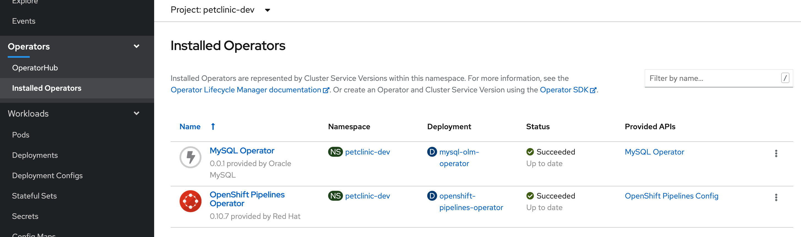

= Comparison Walkthrough =
:experimental:

Premise: You have a (petclinic) spring application that you need to  host in the cloud.  Let’s look at how different facets of this are done in AWS and then in OpenShift

== Local creation ==

Show our demo running locally 

In a local shell, go to the springboot directory and run the following commands

----
source scripts/shell-setup.sh
cd $DEMO_HOME/spring-framework-petclinic
code . 
----

VSCode will open.  Indicate that you want to run in a container.

Then you want to make sure you are in the `trigger-test` branch

----
git checkout trigger-test
----

Make a change to the welcome.jsp file, mostly to give an excuse to checkin.  You can use kbd:[Cmd+ p] to quickly open it in vscode.

Add the following after the `<h2>` tags:

----
<h3> Hello from vscode </h3>
----

[NOTE]
.If showing AWS compilation next
====
If you war attempting to show AWS builds, this is a good time to push this to code commit given
that the pipeline can take up to _18 minutes_ to run.  See link:../README.adoc[CodeCommit
section of this doc]  for information on setting up a CodeCommit repo that is connected to a
AWS Pipeline.

----
git commit -am"Add welcome header"
git push git-codecommit.ap-southeast-2.amazonaws.com
----

where `git-codecommit.ap-southeast-2.amazonaws.com` is the name of the remote that points to the AWS CodeCommit repo.  You can see a list of the remotes using the `git remote` command

AWS Pipeline can be found link:https://ap-southeast-2.console.aws.amazon.com/codesuite/codepipeline/pipelines/petclinic-pipeline/view?region=ap-southeast-2[here] ([red]#need to manually adjust this link#)

====

Next compile the application locally (NOTE: The HSQLDB will use local in memory database)

----
./mvnw package -PHSQLDB -DskipTests
----

3. Add a tomcat server

NOTE: This section requires the use of the vscode extension `adashen.vscode-tomcat` and assumes you're running from within the `quay.io/mhildenb/comparison-demo-base:1.0` (dev) container

* From the vscode file explorer, look for the tomcat panel and mouse over the _+_ button on the right

image:../images/tomcat-add.png[]

* Enter the tomcat directory when prompted: `/opt/webserver`

NOTE: If the tomcat server fails to appear, you can find some <<Troubleshooting Tomcat Server, troubleshooting steps here>> as well as a way to run the demo without the extension.

4. Debug .war file by right clicking on the newly added tomcat server and selecting _Debug War Package_.  You should find the war in `target` subdirectory of the workspace.  Maven will also output where it put in the .war at the end of the `install` goal.

5. Go to the remote tab (on the left side) and go down to the forwarded ports panel.  Pick to have 8080 forwarded.  Then hit the globe icon to open a browser to that port.

6. Notice that the welcome should show, but the image is incorrect

image:../images/ugly-pet.png[]

7. Correct the image by running the following from the base directory

----
example/change-pet-image.sh good-pets.png
git commit -am"Fix pet image"
git push git-codecommit.ap-southeast-2.amazonaws.com
----

[NOTE]
====
It might make sense to jump to the AWS pipeline and make sure the second checkin is paused by disabling one of the transitions that the first checkin has already been through.  You can do this by clicking on the transition and then giving a reason for disabling.

image:../image/pause-pipeline.png[]

AWS Pipeline can be found link:https://ap-southeast-2.console.aws.amazon.com/codesuite/codepipeline/pipelines/petclinic-pipeline/view?region=ap-southeast-2[here] ([red]#need to manually adjust this link#)
====

== Touring AWS ==

=== Code Pipeline ===

Show the different aspects of the code pipeline

1. Overall Pipeline

2. Pipeline build steps

in vscode, use kbd:[cmd + p] to quickly open buildspec.yaml

2. Pipeline Unit Test

3. Pipeline Deployment

=== Elastic Beanstalk ===

1. Dashboard

* point out the two different environments

* Point out that each environment has a different URL

2. Dev Configuration

image:../images/aws-eb-configuration-overview.png[]

3. Instances

* point out that these are VMs that can be ssh'ed into

* point out the different security groups that are used to isolate the different bits

image:../images/aws-eb-instances.png[]

3. Load Balancer

image:../images/aws-eb-loadbalancer.png[]

3. RDS

image:../images/aws-eb-rds.png[]

4. If time allows, show the options that need to be choosen when creating a new environment

image:../images/aws-eb-new-env.png[]

5. Finally, return to the pipeline and reject the bad image:

image:../images/aws-pipeline-reject.png[]

6. and then allow the previous change to flow through by re-enabling the pipeline

== OpenShift: Development Environment Creation ==

=== Prerequisite: Introduction to Operators ===

1. Talk about the Operator market place and what it means for developers in terms of self service

** Service Mesh Operator
** Crunchy DB

2. Install (or Describe) the Pipelines Operator

image:../images/operator-pipelines.png[]

3. Install (or Describe) the MySQL Operator as per link:../README.adoc[README]

** Describe how this is an adapted Helm Chart

=== Initial Developer Build (with S2I) ===

[ALERT]
==== 
Switch to comparison demo vscode window
====

1. Create a new project.  [blue]#Describe that this is something like creating a new environment in elastic beanstalk or just in general.#

----
oc new-project petclinic-dev
----

2. Show the creation of a new MySQL cluster using the cluster YAML by first demonstrating that the operator is available

Once the operator has been copied to our project, we are free to create the resources (CRD) that will create our cluster.  

** Hit kbd:[cmd+p] to quickly open `mysql-cluster-instance.yaml` and describe that this is all that is necessary to setup a database cluster on the kubernetes instance

image:../images/mysql-cluster-instance.png[]

Possibly also show the cluster creation script before issuing.  Then issue the command:

----
$DEMO_HOME/scripts/create-sql-cluster.sh 
----

Next, quickly show how the results of the command have caused creation in the UI:

_While waiting for the creation of the MySQL cluster, move on to the build_

[ALERT]
==== 
Switch to spring-petclinic vscode window
====

3. Create from template 

* mention that this could be done from templates if we weren't worried about ongoing maintainance of the database

Open the _Developer Perspective_ in the _petclinic-dev_ project and click the _+_ button.  Then select _From Catalog_

image:../images/dev-from-catalog.png[]

image:../images/dev-tomcat-template.png[]

NOTE: Run either of these from the spring-boot vscode instance

[OPTION 1]
.Install based on S2I
====

To create from a S2I template, use the following command

----
oc new-app --template=jws31-tomcat8-basic-s2i --param=SOURCE_REPOSITORY_URL='https://github.com/hatmarch/spring-framework-petclinic.git' --param=SOURCE_REPOSITORY_REF='trigger-test' --param=CONTEXT_DIR='' 
----

====

[OPTION 2]
.Install based on Binary
====
For more information on building from a binary that is created from this, perhaps see link:https://docs.openshift.com/container-platform/3.6/dev_guide/dev_tutorials/binary_builds.html[here] and especially link:http://v1.uncontained.io/playbooks/app_dev/binary_deployment_howto.html[here]

To create from a pre-compiled binary, use the following command:

----
oc new-build jboss-webserver31-tomcat8-openshift:1.4 --binary=true --name=jws-app

# setup the app first before building so that the steps of the build can be shown
oc new-app jws-app --allow-missing-imagestream-tags=true
oc apply -f $DEMO_HOME/kube/services/jws-app-binary.yaml

# print out the route to the application
echo "https://$(oc get route jws-app -o jsonpath='{.spec.host}')/"

# Run from the root of the spring dev directory (could use --follow=true on this command if you want)
oc start-build jws-app --from-file=target 

----

====

4. Then can show the logs of the S2I running using this command

----
oc logs -f bc/jws-app
----

Point out how (*S2I builds only*)

* it's pulling from the github repo the branch specified
* it's building into a container that has all the runtime libraries
* uses the profile "openshift" by default

Take a look at the console and show how it's using OpenShift's built in BuildSystem

image:../images/openshift-builds.png[]

Also consider showing the _Build Overview_ from the *Developer Perspective*

image:../images/build-overview.png[]

5. Build will take some amount of time [blue]#S2I takes about 10 minutes#

* Can show that the SQL cluster is there waiting
* Show the developer perspective

image:../images/developer-topology.png[]

==== Points to Teach from the UI ====

* Routes
* Services 
* Pods

Show how more pods can be created, for example

== Continuous Integration ==

WARNING: This section assumes that the petclinic-cicd project has been created.  See link:../README.adoc[README.adoc] for more details.

=== Openshift ===

1. Point out the OpenShift Pipeline Operator

2. Show the Pipeline overview

3. Talk about 
    
    * Tasks
    * Trigger Events

==== Trigger build from internal repo ====

4. Point out internal git repo

==== Trigger build from external repo ====

1. Get the URL of the trigger event

----
oc get route 
----

1. Open the settings page of the github repo link:https://github.com/hatmarch/spring-framework-petclinic/settings/hooks/192601155[here]

Update the webhook with the URL from above and activate it

image:../images/pipeline-github-webhook.png[]

[ALERT]
====
Switch to spring-petclinic-vscode window
====

2. Make a change to the welcome.jsp

----
    <h3> Hello from OpenShift Pipelines </h3>
----

3. [red]#Make sure the OpenShift Developer View of the Pipeline can be seen

==== Trigger deployment from code pipeline? ====

6. Once dev build is working, show that this can be deployed to staging by executing the deploy to staging pipeline

----
tkn p start petclinic-deploy-stage-tomcat -n petclinic-cicd                                                          
? Value for param `IMAGE_TAG` of type `string`? (Default is `latest`) latest
Pipelinerun started: petclinic-deploy-stage-tomcat-run-fhzh5
----

Notice that this build will fail.  We need to create a staging environment first.  Show from the Dev Perspective that the staging environment is an empty shell

7. Run the following command to finish building 

----
$DEMO_HOME/scripts/create-staging-full.sh install -p petclinic
----

Now this time attempt to trigger the pipeline from the UI.  Switch to the `petclinic-cicd` environment.  Select _Pipelines_ from the left panel then right click on ... and select start.  Indicate that the latest build is desired.

image:../images/pipelines-deploy-to-staging-ui.png[]

8. When the build completes, move to the petclinic-staging project and click the badge to open the staging website

==== Rollback with pipelines ====

7. You can show rollback to a previous version by making sure that previous version is tagged

----
$ oc tag petclinic-dev/jws-app@sha256:e7d058394a1876d68f36d1851e907552738fe5033fdcdca81509abfbabac5c77 petclinic-dev/jws-app:1.0
Tag petclinic-dev/jws-app:1.0 set to petclinic-dev/jws-app@sha256:e7d058394a1876d68f36d1851e907552738fe5033fdcdca81509abfbabac5c77.
$ tkn p start petclinic-deploy-stage-tomcat -n petclinic-cicd                                                          
? Value for param `IMAGE_TAG` of type `string`? (Default is `latest`) 1.0
Pipelinerun started: petclinic-deploy-stage-tomcat-run-fhzh5

In order to track the pipelinerun progress run:
tkn pipelinerun logs petclinic-deploy-stage-tomcat-run-fhzh5 -f -n petclinic-cicd
$ tkn pr logs -L -f -n petclinic-cicd   
----

== Monitoring Application ==

=== OpenShift ===

See link:https://medium.com/logistimo-engineering-blog/tomcat-jvm-metrics-monitoring-using-prometheus-in-kubernetes-c313075af727[here] for getting information into Prometheus 

Quick Nod: Show how this is possible from the Developer Perspective.  Select _Advanced > Metrics_ and then click the button to create an example query.  You should be able to see CPU footprint of the different parts of the Tekton pipeline.

=== AWS ===

Equivalent would be CloudWatch

== Appendix ==

=== Troubleshooting Tomcat Server ===

If the tomcat extension fails to run, you can attempt the following:

remote any old tomcat files

----
rm -f /opt/webserver/webse*
----

Attempt to readd tomcat to /opt/webserver per the instructions above

if that still doesn't work, rebuild container.

If all else fails, [blue]#you can run the tomcat server locally#.  Start in the project base directory and run

----
example/run-tomcat.sh start

# Make sure there are no errors and wait until you see this prompt:
**** [main] INFO  org.apache.catalina.startup.Catalina- Server startup in 13275 ms
----

When it starts up you should be able to expose the port as you would through the tomcat extension.  Stop the topcat server from that same command line with kbd:[ctrl + c] 

=== Optional: Running with SQL locally ===

If you want to run from mysql locally, the MySQL profile expects to connect on docker.for.mac.localhost:3306.

1. Build for MySQL: You'll need to use the `MySQL` profile

----
./mvnw package -PMySQL -DskipTests
----

Then choose one of the following DB options:

** Run from a docker container 

----
docker run --name mysql-petclinic -e MYSQL_ROOT_PASSWORD=petclinic -e MYSQL_DATABASE=petclinic -p 3306:3306 mysql:5.7.8
----

** Run connected to the sqlserver in the dev directory

----
oc port-forward -n petclinic-dev svc/jws-app-sql 3306:3306
----