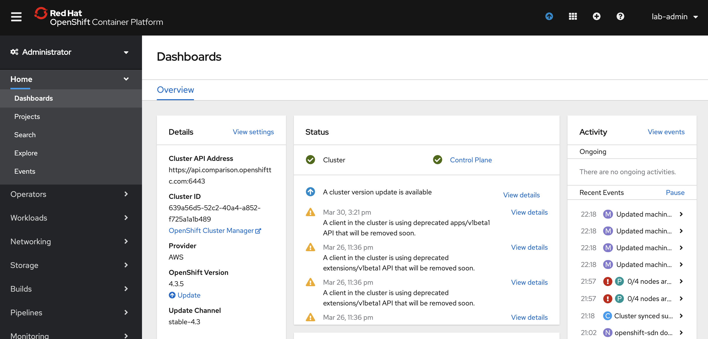

= Comparison Walkthrough =
:experimental:
:toc:
:toclevels: 4

== Introduction ==
[WARNING]
====
Make sure you run the following command before executing any of these commands.

----
source scripts/shell-setup.sh 
----
====

Premise: You have a (petclinic) spring application that you need to  host in the cloud.  Let’s look at how different facets of this are done in AWS and then in OpenShift.

(See also <<../Readme.adoc#_introduction,Introduction>> set out in the link:README.adoc[])

== Petclinic Running Locally ==

Show our demo running locally 

WARNING: First make sure your trigger-test branch is ready to go by running `$DEMO_HOME\spring-framework-petclinic\example\restore-demo.sh`.  This will put the right image in place and reset the contents of the welcome.jsp

. In a local shell, go to the springboot directory and run the following commands
+
----
source scripts/shell-setup.sh
cd $DEMO_HOME/spring-framework-petclinic
code . 
----
+
. VSCode will open.  Indicate that you want to run in a container.
+
Then you want to make sure you are in the `trigger-test` branch
+
WARNING: Once the terminal is up, make sure to copy the api login string from the appropriate cluster into your console
+
----
git checkout trigger-test
----
+
. Make a change to the welcome.jsp file, mostly to give an excuse to checkin.  You can use kbd:[Cmd+ p] to quickly open it in vscode.

. Add the following after the `<h2>` tags:
+
----
<h3> Hello from vscode </h3>
----
+
[NOTE]
.If showing AWS compilation next
====
If you war attempting to show AWS builds, this is a good time to push this to code commit given
that the pipeline can take up to _18 minutes_ to run.  See link:../README.adoc[CodeCommit
section of this doc]  for information on setting up a CodeCommit repo that is connected to a
AWS Pipeline.

----
git commit -am"Add welcome header"
git push git-codecommit.ap-southeast-2.amazonaws.com
----

where `git-codecommit.ap-southeast-2.amazonaws.com` is the name of the remote that points to the AWS CodeCommit repo.  You can see a list of the remotes using the `git remote` command

AWS Pipeline can be found link:https://ap-southeast-2.console.aws.amazon.com/codesuite/codepipeline/pipelines/petclinic-pipeline/view?region=ap-southeast-2[here] ([red]#need to manually adjust this link#)

====
+
. Next compile the application locally (NOTE: The HSQLDB will use local in memory database)
+
----
./mvnw package -PHSQLDB -DskipTests
----
+
. If you want to show debugging and the tomcat extension, follow the instructions <<Debugging with Tomcat,here>>.  Otherwise run the following from the project base directory:
+
----
example/run-tomcat.sh start

# Make sure there are no errors and wait until you see this prompt:
**** [main] INFO  org.apache.catalina.startup.Catalina- Server startup in 13275 ms
----
+
. When it starts up you should be able to expose the port as you would through the tomcat extension.  _NOTE: You can stop the topcat server from that same command line with kbd:[ctrl + c]_

. Go to the remote tab (on the left side) and go down to the forwarded ports panel.  Pick to have 8080 forwarded.  Then hit the globe icon to open a browser to that port.
+
image:../images/port-forward.png[]
+
. Notice that the welcome should show, but the image is incorrect
+

+
. Correct the image by running the following from the base directory
+
----
example/change-pet-image.sh good-pets.png
git commit -am"Fix pet image"
git push git-codecommit.ap-southeast-2.amazonaws.com
----
+
[NOTE]
====
It might make sense to jump to the AWS pipeline and make sure the second checkin is paused by disabling one of the transitions that the first checkin has already been through.  You can do this by clicking on the transition and then giving a reason for disabling.

AWS Pipeline can be found link:https://ap-southeast-2.console.aws.amazon.com/codesuite/codepipeline/pipelines/petclinic-pipeline/view?region=ap-southeast-2[here] ([red]#need to manually adjust this link#)
====

== Petclinic on AWS ==

=== Code Pipeline ===

Show the different aspects of the code pipeline

. Overall Pipeline

. Pipeline build steps
+
in vscode, use kbd:[cmd + p] to quickly open buildspec.yaml
+
image:../images/aws-buildspec.png[]
+
. Pipeline Unit Test
+
image:../images/pipeline-unittest.png[]
+
. Pipeline Deployment

=== Elastic Beanstalk ===

. Dashboard
** point out the two different environments
** Point out that each environment has a different URL
+
image:../images/aws-eb-dashboard.png[]
+
. Dev Configuration
+

+
. Instances
** point out that these are VMs that can be ssh'ed into
+
.From the ComparisonDemo shell
----
eb ssh

INFO: Attempting to open port 22.
INFO: SSH port 22 open.
INFO: Running ssh -i /home/jboss/.ssh/mwh-bastion.pem ec2-user@13.210.14.53
Last login: Sat Mar 28 02:38:00 2020 from 123.208.49.188
 _____ _           _   _      ____                       _        _ _
| ____| | __ _ ___| |_(_) ___| __ )  ___  __ _ _ __  ___| |_ __ _| | | __
|  _| | |/ _` / __| __| |/ __|  _ \ / _ \/ _` | '_ \/ __| __/ _` | | |/ /
| |___| | (_| \__ \ |_| | (__| |_) |  __/ (_| | | | \__ \ || (_| | |   <
|_____|_|\__,_|___/\__|_|\___|____/ \___|\__,_|_| |_|___/\__\__,_|_|_|\_\
                                       Amazon Linux AMI

This EC2 instance is managed by AWS Elastic Beanstalk. Changes made via SSH 
WILL BE LOST if the instance is replaced by auto-scaling. For more information 
on customizing your Elastic Beanstalk environment, see our documentation here: 
http://docs.aws.amazon.com/elasticbeanstalk/latest/dg/customize-containers-ec2.html
[ec2-user@ip-172-31-2-215 ~]$ 
----
+
** point out the different security groups that are used to isolate the different bits
+
image:../images/aws-eb-instances.png[]
+
. Load Balancer
+
image:../images/aws-eb-loadbalancer.png[]
+
. RDS
+

+
. If time allows, show the options that need to be choosen when creating a new environment
+

+
. Finally, return to the pipeline and reject the bad image:
+

+
. and then allow the previous change to flow through by re-enabling the pipeline

== OpenShift: Development Environment Creation ==

When showing off concepts of OpenShift

=== Prerequisite: Introduction to Operators ===

. Start with the link:https://console-openshift-console.apps.comparison.openshifttc.com/dashboards[Dashboard of the cluster]
+

2. From the UI, opt to create our new project (which is the equivalent of an Elastic Beanstalk Environment for our purposes).

1. Talk about the Operator marketplace and what it means for developers in terms of self service

** For example: Crunchy DB

2. Install (or Describe) the Pipelines Operator

3. Install (or Describe) the MySQL Operator as per link:../README.adoc[README]

** Describe how this is an adapted Helm Chart

Only move on to the next step when you see that the operators have successfully been copied into the the current environment

image:../images/operator-installed.png[]

=== Initial Developer Build (with S2I) ===

[ALERT]
==== 
Switch to comparison demo vscode window (dark theme)
====

. Once the operator has been copied to our project, we are free to create the resources (CRD) that will create our cluster. Show the creation of a new MySQL cluster using the cluster YAML 
+
** Hit kbd:[cmd+p] to quickly open `mysql-cluster-instance.yaml` and describe that this is all that is necessary to setup a database cluster on the kubernetes instance
+

+
Possibly also show the cluster creation script before issuing.  
+
. Next issue the command:
+
----
# create the project if you haven't already, otherwise use oc project petclinic-dev
oc new-project petclinic-dev
$DEMO_HOME/scripts/create-sql-cluster.sh 
----
+
. Next, quickly show how the results of the command have caused creation in the UI:
+
image:../images/operator-sql-creation.png[]
+
_While waiting for the creation of the MySQL cluster, move on to the build_
+
[ALERT]
==== 
Switch to spring-petclinic vscode window
====
+
. Create from template 
** mention that this could be done from templates if we weren't worried about ongoing maintainance of the database
+
.. Open the _Developer Perspective_ in the _petclinic-dev_ project and click the _+_ button.  Then select _From Catalog_
+
image:../images/dev-from-catalog.png[]
+

+
WARNING: Be sure to select the *Tomcat 8* template.  Tomcat 7 will definitely not work properly.

==== Install based on S2I ====

To create from a S2I template, use the following command (or mine this information to fill in the corresponding information on the template).  [blue]#NOTE that this is coming from the github repo, _not_ codecommit#

----
oc new-app --template=jws31-tomcat8-basic-s2i --param=SOURCE_REPOSITORY_URL='https://github.com/hatmarch/spring-framework-petclinic.git' --param=SOURCE_REPOSITORY_REF='trigger-test' --param=CONTEXT_DIR='' \
    --param=APPLICATION_NAME=petclinic
----

NOTE: If you want to install based entirely on a binary build and skip the UI template part, see <<Initial Binary Build,instructions in Appendix>>

You can show the logs of the S2I running using this command (or finding from the UI)

----
oc logs -f bc/petclinic
----

Point out how (*S2I builds only*)

* it's pulling from the github repo the branch specified
* it's building into a container that has all the runtime libraries
* uses the profile "openshift" by default

Take a look at the console and show how it's using OpenShift's built in BuildSystem

Also consider showing the _Build Overview_ from the *Developer Perspective*

Build will take some amount of time [blue]#S2I takes about 10 minutes# and in the meantime can show off:

* Can show that the SQL cluster is there waiting
* Show the developer perspective

image:../images/developer-topology.png[]

==== Points to Teach from the UI ====

* Routes
* Services 
* Pods

If the build is not yet finished, you can cancel it with the following command:

----
oc project petclinic-dev
oc cancel-build $(oc get build -o custom-columns=NAME:.metadata.name --no-headers=true)
----

Once the build is cancelled, you can start a binary build [blue]#from the Spring-Petclinic vscode instance# with this command (from the root of the spring dev directory):

----
# Make sure to build something appropriate for OpenShift before pushing out
./mvnw package -Popenshift -DskipTests

# NOTE append --follow=true on this command if you want to follow logs in window
oc start-build petclinic --from-file=target -n petclinic-dev
----

_[blue]#build should take about 2.5 minutes#_

Show how more pods can be created, for example

image:../images/dev-more-pods.png[]

And see how those additional pods are referenced from the `service`

=== Tagging a Build ===

Finally, for the sake of rollback later on, we're going to tag the current build *BEFORE* we start our pipeline.

----
oc tag petclinic:latest petclinic:1.0 -n petclinic-dev
----

== Openshift: Continuous Integration with Pipelines ==

[ALERT]
====
switch to ComparisonDemo vscode window 
====

[WARNING]
====
This section assumes that the petclinic-cicd project has been created.  See link:../README.adoc[README.adoc] for more details.

If the operator is already installed, you can create the cicd environment with the following command (also linked to link:https://www.evernote.com/l/AWTspU8-e8VP4aXjgscTedmuK0aWrizaU4o[here]

----
$DEMO_HOME/scripts/create-cicd.sh install --project-prefix petclinic --user USER --password <PASSWORD>
----

====

=== OpenShift Pipeline Operator and Overview ===

. Point out the OpenShift Pipeline Operator

. Show the Pipeline overview

. Talk about 
** Tasks
** Trigger Events
** VS Code Extension

[WARNING]
====
As of the writing of this, you cannot trigger a pipeline that requires a workspace from the UI.  Instead, you can create a pipeline run manually by applying this yaml:

----
oc apply -f $DEMO_HOME/kube/tekton/pipelinerun/petclinic-dev-pipeline-tomcat-run.yaml
----

This should trigger a pipeline run with the workspace properly configured.  If you then need to trigger the pipeline again, you can now use the UI if you go to the pipeline run in question, right-click, and choose _Rerun_

====

=== Trigger build from external repo ===

. Get the URL of the trigger event
+
----
echo "http://$(oc get route webhook-github -o jsonpath='{.spec.host}')/"
----
+
. Open the settings page of the github repo link:https://github.com/hatmarch/spring-framework-petclinic/settings/hooks/192601155[here]
+
. Update the webhook with the URL from above and activate it
+

+
[ALERT]
====
Switch to spring-petclinic-vscode window
====
+
. Make a change to the welcome.jsp
+
----
    <h3> Hello from OpenShift Pipelines </h3>
----
+
. [red]#Make sure the OpenShift Developer View of the Pipeline can be seen
+
image:../images/developer-pipeline-run.png[]
+
. Then run the checkin command
+
----
git commit -am"Pipeline Message"
git push origin
----
+
. Switch over to the OpenShift pipeline and notice its running
+
* Point out different phases from the UI
** Point out parallel analysis and unit test phases
* Look at logs from console
* from `ComparisonDemo` show the cli for tekton for follow the steps of the latest pipeline run
+
----
tkn pr logs -L -f
----
+
. Play around with the existing petclinic app and show that it's not affected by the pipeline run
+
** For demonstrating the environments are separate, add an Owner for the development environment
+

+
. Tour the cicd project that we created

** Sonarqube: show the results of analysis by navigating to the endpoint
+
----
echo "https://$(oc get route sonarqube -o jsonpath='{.spec.host}' -n petclinic-cicd)/"
----
+
** Internal Git Repo
+
----
echo "http://$(oc get route gogs -o jsonpath='{.spec.host}' -n petclinic-cicd)/"
----
+
** Nexus Repository
+
----
echo "http://$(oc get route nexus -o jsonpath='{.spec.host}' -n petclinic-cicd)/"
----
+
NOTE: [blue]#Build will take about 10 minutes to complete# This is a good time to discuss that OpenShift can also integrate with Jenkins Pipeline
+
. Upon return, show from the Dev Perspective that a new build has been released replacing the S2I one we uploaded before

==== Optional: Trigger build from internal repo ====

. Point out internal git repo
. Log in as administrator (gogs/gogs)
. Go to _Settings_ for the petclinic repo and enter this service (since this is all cluster local) that represents a gogs compatible Tekton/OpenShift Pipeline trigger
+
----
el-webhook.petclinic-cicd.svc.cluster.local:8080
----
+
. Open a file in gogs (such as welcome.jsp) and use the pen icon to edit it locally and check in (to trigger a build)

=== Deploy to Staging ===

. Once dev build is working, show that this can be deployed to staging by executing the deploy to staging pipeline
+
----
tkn p start petclinic-deploy-stage-tomcat -n petclinic-cicd                                                          
? Value for param `IMAGE_TAG` of type `string`? (Default is `latest`) latest
Pipelinerun started: petclinic-deploy-stage-tomcat-run-fhzh5
----
+
Notice that this build will fail.  You can look for the error message in the UI or you can run this command in the shell
+
----
tkn pr logs -L

# You will get error output that looks something like the following
[promote-stage : run-commands] Error from server (NotFound): deploymentconfigs.apps.openshift.io "petclinic" not found

failed to get logs for task promote-stage : container step-run-commands has failed  : [{"name":"","digest":"","key":"StartedAt","value":"2020-04-02T07:12:28Z","resourceRef":{}}]
TaskRun petclinic-deploy-stage-tomcat-run-2tq5x-promote-stage-w72rp has failed
----
+
The issue is that *we need to create a full staging environment first.*  
+
. Show from the Dev Perspective that the staging environment is an empty shell
+
. Run the following command to finish building 
+
----
$DEMO_HOME/scripts/create-staging-full.sh install -p petclinic
----
+
WARNING: [blue]#This command will take a 2-5 minutes to complete#
+
This time let's attempt to trigger the pipeline from the UI. 
+ 
. Back on the OpenShift console, _Be sure to switch to the `petclinic-cicd` project_, and then select _Pipelines_ from the left panel.  Right click on ... and select start.  Indicate that the `latest` image tag is desired.
+

+
. When the build completes, move to the `petclinic-staging` project and click the badge to open the staging website
+
image:../images/openshift-staging-badge.png[]
+
. _To prove that we're looking at a different instance_: Query the list of owners, and show that the one we created earlier is not there.

=== Optional: Rollback with pipelines ===

You can show rollback to a previous version by making sure that previous version is tagged as per <<Tagging,here>>

----
$ tkn p start petclinic-deploy-stage-tomcat -n petclinic-cicd                                                          
? Value for param `IMAGE_TAG` of type `string`? (Default is `latest`) 1.0
Pipelinerun started: petclinic-deploy-stage-tomcat-run-fhzh5

In order to track the pipelinerun progress run:
tkn pipelinerun logs petclinic-deploy-stage-tomcat-run-fhzh5 -f -n petclinic-cicd
$ tkn pr logs -L -f -n petclinic-cicd   
----

== Monitoring Application [red]#(Unfinished)# ==

=== OpenShift ===

See link:https://medium.com/logistimo-engineering-blog/tomcat-jvm-metrics-monitoring-using-prometheus-in-kubernetes-c313075af727[here] for getting information into Prometheus 

Quick Nod: Show how this is possible from the Developer Perspective.  Select _Advanced > Metrics_ and then click the button to create an example query.  You should be able to see CPU footprint of the different parts of the Tekton pipeline.

image:../images/metrics-general.png[]

=== AWS ===

Equivalent would be CloudWatch

== Appendix ==

=== Debugging with Tomcat ===

. Add a tomcat server
+
NOTE: This section requires the use of the vscode extension `adashen.vscode-tomcat` and assumes you're running from within the `quay.io/mhildenb/comparison-demo-base:1.0` (dev) container
+
. From the vscode file explorer, look for the tomcat panel and mouse over the _+_ button on the right
+
image:../images/tomcat-add.png[]
+
. Enter the tomcat directory when prompted: `/opt/webserver`
+
NOTE: If the tomcat server fails to appear, you can find some <<../Readme.adoc#_troubleshooting_local_tomcat_server,troubleshooting steps here>> as well as a way to run the demo without the extension.
+
. Debug .war file by right clicking on the newly added tomcat server and selecting _Debug War Package_.  You should find the war in `target` subdirectory of the workspace.  Maven will also output where it put in the .war at the end of the `install` goal.
+
image:../images/tomcat-debug.png[]

=== Initial Binary Build ===

For more information on building from a binary that is created from this, perhaps see link:https://docs.openshift.com/container-platform/3.6/dev_guide/dev_tutorials/binary_builds.html[here] and especially link:http://v1.uncontained.io/playbooks/app_dev/binary_deployment_howto.html[here]

To create from a pre-compiled binary, use the following command:

----
oc new-build jboss-webserver31-tomcat8-openshift:1.4 --binary=true --name=petclinic

# setup the app first before building so that the steps of the build can be shown
oc new-app petclinic --allow-missing-imagestream-tags=true
oc apply -f $DEMO_HOME/kube/services/petclinic-binary.yaml

# print out the route to the application
echo "https://$(oc get route petclinic -o jsonpath='{.spec.host}')/"

# Run from the root of the spring dev directory (could use --follow=true on this command if you want)
oc start-build petclinic --from-file=target 
----

=== Optional: Running with SQL locally ===

If you want to run from mysql locally, the MySQL profile expects to connect on docker.for.mac.localhost:3306.

. Build for MySQL: You'll need to use the `MySQL` profile
+
----
./mvnw package -PMySQL -DskipTests
----
+
. Then choose one of the following DB options:
.. _OPTION 1:_ Run from a docker container 
+
----
docker run --name mysql-petclinic -e MYSQL_ROOT_PASSWORD=petclinic -e MYSQL_DATABASE=petclinic -p 3306:3306 mysql:5.7.8
----
+
.. _OPTION 2:_ Run connected to the sqlserver in the dev directory
+
----
oc port-forward -n petclinic-dev svc/petclinic-sql 3306:3306
----